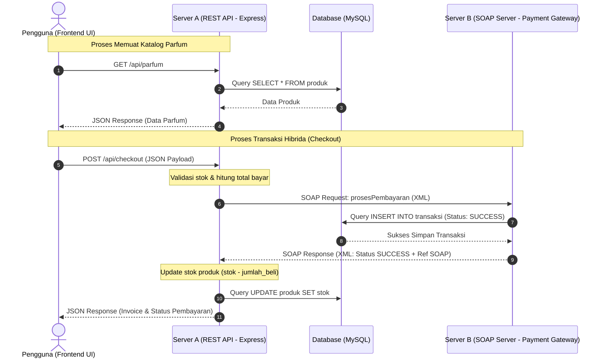

# 🌟 PARFUMKU - Hybrid Distributed System Demo

> **Simulasi Sistem Terdistribusi Hibrida (REST API & SOAP Interoperability)**  
> Proyek ini dirancang sebagai demo implementasi arsitektur hibrida modern yang menggabungkan kemudahan **REST API** untuk interaksi frontend dengan reliabilitas **SOAP API** untuk simulasi transaksi perbankan/payment gateway.

---

## 👥 Tim Pengembang
* **Edwin Helmi Setiawan**
* **Lutfi Syahrul Ramdani**

---

## 🏗️ Arsitektur Sistem (Hybrid REST & SOAP)

Sistem ini menerapkan konsep **Hybrid Web Services**. Berikut adalah visualisasi alur komunikasi antarkomponen:



### 🔍 Mengapa Menggunakan Arsitektur Hybrid?

Sistem ini menggunakan dua jenis web service yang berbeda untuk tujuan yang spesifik:

1. **REST API (Server A - Port 8001)**
   * **Mengapa REST?** REST sangat cocok untuk interaksi langsung dengan frontend (browser). REST menggunakan format data **JSON** yang ringan, mudah diparse oleh JavaScript, dan memiliki performa cepat untuk operasi pembacaan data katalog (`GET /api/parfum`) serta pengiriman data checkout awal.
   
2. **SOAP API (Server B - Port 8002)**
   * **Mengapa SOAP?** Server B menyimulasikan sistem perbankan / *Payment Gateway* korporat (*Legacy System*). SOAP (Simple Object Access Protocol) menggunakan format **XML** dengan struktur ketat yang didefinisikan lewat kontrak **WSDL** (*Web Services Description Language*). SOAP dipilih karena standar keamanan tingkat tinggi, keandalan transaksi (ACID compliance), serta integritas tipe data yang ketat yang sangat disukai oleh industri keuangan dan perbankan besar.

---

## 🗄️ Persiapan Database (MySQL)

Sistem ini membutuhkan satu database bernama `db_minyakku`. Ikuti langkah berikut untuk menyiapkannya:

1. Jalankan **XAMPP** atau **Laragon** lalu aktifkan modul **MySQL**.
2. Buka database manager pilihan Anda (phpMyAdmin / HeidiSQL / DBeaver).
3. Buat database baru bernama `db_minyakku`:
   ```sql
   CREATE DATABASE db_minyakku;
   ```
4. Masuk ke database tersebut dan eksekusi query berikut untuk membuat tabel dan data sampel:

```sql
USE db_minyakku;

-- 1. Pembuatan Tabel Produk
CREATE TABLE IF NOT EXISTS produk (
    id INT AUTO_INCREMENT PRIMARY KEY,
    brand VARCHAR(100) NOT NULL,
    nama_produk VARCHAR(150) NOT NULL,
    deskripsi TEXT,
    harga DECIMAL(12,2) NOT NULL,
    stok INT NOT NULL
);

-- 2. Pembuatan Tabel Transaksi
CREATE TABLE IF NOT EXISTS transaksi (
    id INT AUTO_INCREMENT PRIMARY KEY,
    invoice_no VARCHAR(50) NOT NULL,
    produk_id INT NOT NULL,
    jumlah_beli INT NOT NULL,
    total_bayar DECIMAL(12,2) NOT NULL,
    status_pembayaran VARCHAR(20) NOT NULL,
    nomor_rekening_pembeli VARCHAR(50) NOT NULL,
    referensi_soap VARCHAR(100) NOT NULL,
    FOREIGN KEY (produk_id) REFERENCES produk(id)
);

-- 3. Inisialisasi Data Sampel Produk
INSERT INTO produk (brand, nama_produk, deskripsi, harga, stok) VALUES
('Chanel', 'Bleu de Chanel', 'Parfum maskulin legendaris dengan aroma citrus woody yang sangat mewah dan elegan.', 2500000.00, 10),
('Dior', 'Sauvage', 'Aroma fresh spicy yang maskulin dan dinamis, memberikan kesan petualang tangguh.', 2300000.00, 15),
('Creed', 'Aventus', 'Kombinasi aroma pineapple, birchwood, dan oakmoss yang eksklusif untuk pria sukses.', 4500000.00, 5),
('YSL', 'La Nuit de L\'Homme', 'Kombinasi cardamom, lavender, dan cedarwood yang romantis dan sensual.', 1800000.00, 8);
```

---

## 🚀 Cara Menjalankan Sistem

Pastikan Anda telah memasang **Node.js** di komputer Anda. Ikuti langkah-langkah di bawah ini:

### Langkah 1: Instalasi Dependensi
Jalankan perintah berikut di root folder proyek untuk mengunduh semua package yang diperlukan:
```bash
npm install
```

### Langkah 2: Jalankan Server B (SOAP Payment Gateway)
Server B harus berjalan terlebih dahulu karena Server A akan memverifikasi WSDL-nya saat inisialisasi.
1. Buka terminal baru.
2. Pindah ke direktori `server.b`:
   ```bash
   cd server.b
   ```
3. Jalankan server menggunakan Node.js:
   ```bash
   node server-b.js
   ```
   *Output yang diharapkan:*
   ```text
   [Server B] SOAP Payment Gateway berjalan di http://localhost:8002/wsdl?wsdl
   ```

### Langkah 3: Jalankan Server A (REST API E-Commerce)
1. Buka terminal baru lainnya.
2. Pindah ke direktori `server.a`:
   ```bash
   cd server.a
   ```
3. Jalankan server menggunakan Node.js:
   ```bash
   node server-a.js
   ```
   *Output yang diharapkan:*
   ```text
   [Server A] E-Commerce Parfum REST API berjalan di http://localhost:8001
   ```

### Langkah 4: Jalankan Frontend (Client Web)
1. Buka file `index.html` yang berada di root folder proyek secara langsung di web browser Anda (cukup klik dua kali pada file `index.html` atau klik kanan -> Open with Browser).
2. Selamat! Anda sekarang dapat melihat katalog parfum, melakukan simulasi pembelian dengan memasukkan jumlah beli dan nomor rekening, serta melihat log respon JSON dan riwayat transaksi langsung dari database secara real-time.

---

## 🛠️ Ringkasan Endpoint & Layanan

* **Server A (REST API):**
  * `GET http://localhost:8001/api/parfum` - Mendapatkan seluruh data katalog produk parfum.
  * `GET http://localhost:8001/api/transaksi` - Mendapatkan riwayat 5 transaksi terakhir.
  * `POST http://localhost:8001/api/checkout` - Mengirim data pembelian (memerlukan payload JSON `parfum_id`, `jumlah_beli`, dan `nomor_rekening_pembeli`).
* **Server B (SOAP Service):**
  * WSDL URL: `http://localhost:8002/wsdl?wsdl`
  * Service Endpoint: `http://localhost:8002/wsdl`
  * Method: `prosesPembayaran(invoiceNo, noRekening, nominal, produkId, jumlahBeli)`
